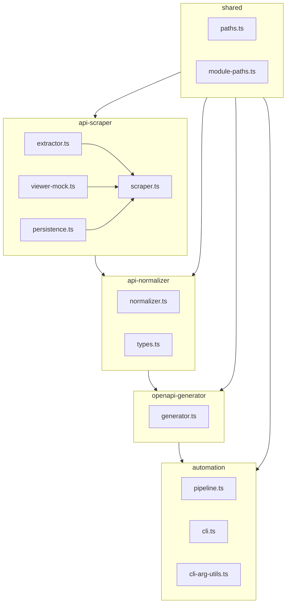
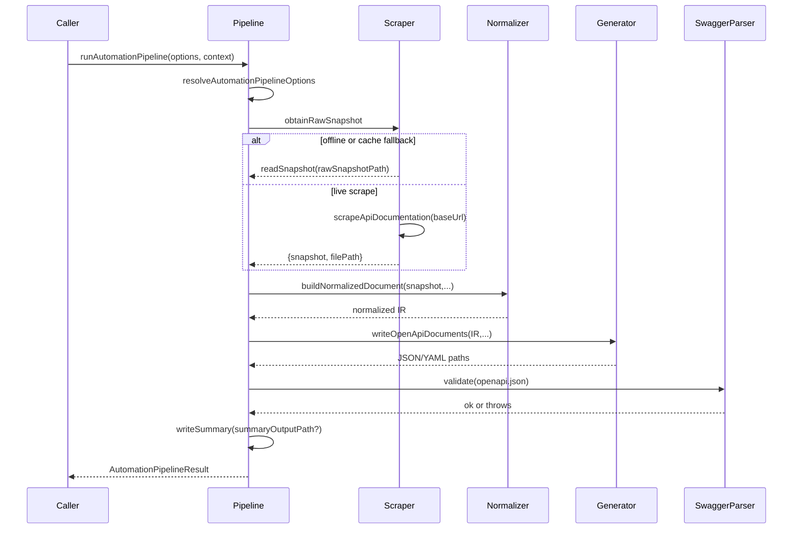
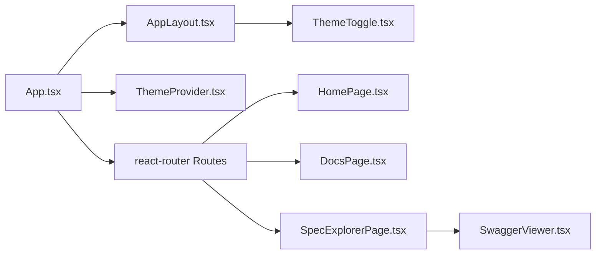

# Low-Level Architecture

This document drills into the internal design of the Proxmox OpenAPI toolkit,
focusing on the core TypeScript modules, helper scripts, and runtime data
structures that power the automation pipeline, CLI, and downstream consumers.

## Module Inventory

### `api-scraper`

| File | Key exports | Responsibility | Inputs | Outputs |
| ---- | ----------- | -------------- | ------ | ------- |
| `scraper.ts` | `scrapeApiDocumentation`, `ScrapeOptions`, `DEFAULT_BASE_URL` | Launch Playwright, load the online API viewer, parse `apidoc.js`, and build a `RawApiSnapshot`. | Base URL, optional headless flag, optional persistence options. | In-memory snapshot + optional file persisted under `var/cache/api-scraper/raw/`. |
| `extractor.ts` | `fetchApiScript`, `parseApiSchema`, `toRawTree`, `countEndpoints` | Provide DOM-free helpers to download and transform the `apiSchema` payload from `apidoc.js` into a sortable tree of `RawApiTreeNode`. | `page.evaluate`, script text. | Typed tree preserving methods, permissions, children. |
| `viewer-mock.ts` | `registerViewerMock`, `isMockEnvironment` | When the `PROXMOX_VIEWER_MOCK` flag is set, intercept Playwright requests to the viewer and respond with fixtures derived from the cached snapshot. | Playwright `BrowserContext`, target base URL. | Deterministic playback for tests and offline runs. |
| `persistence.ts` | `persistSnapshot` | Serialize and write snapshots, ensuring parent directories exist. | Snapshot object, output path. | JSON file terminated with newline. |

#### Snapshot Data Shapes

- `RawApiSnapshot` – timestamp, source URL, document title, root stats, and the
  full schema tree (`RawApiTreeNode[]`).
- `RawApiTreeNode` – path string (e.g., `/nodes/{node}/qemu`), display text,
  methods array, and recursive children.
- `RawApiMethod` – HTTP verb, name/description, permissions (single or array),
  parameter and return schemas, plus feature flags (`proxy`, `download`, `upload`).

### `api-normalizer`

| File | Key exports | Responsibility |
| ---- | ----------- | -------------- |
| `normalizer.ts` | `normalizeSnapshot`, `NormalizeSnapshotOptions` | Walk the raw tree, generate deterministic group slugs, convert permissions into `any`/`all` sets, normalize request/response schemas, and attach metadata (checksums, timestamps, stats). |
| `types.ts` | IR interfaces (`NormalizedApiDocument`, `NormalizedGroup`, `NormalizedEndpoint`, `NormalizedSchema`, `NormalizedSecurity`, `NormalizedPermissionSet`, etc.) | Describe the structural contract that downstream modules rely on. |

Key behaviors:

- Ensures `operationId` is derived as `httpMethod-path-slug`.
- Converts schema constraints (min/max lengths, patterns, enums) into
  `NormalizedConstraints`.
- Copies supplemental metadata (renderers, `default_key`, `instance-types`) into
  a generic `metadata` bag for future enrichment.
- Preserves the previous checksum/`normalizedAt` timestamp when reusing cached
  IR files (`pipeline.ts` passes prior metadata when `usedCache` is `true`).

### `openapi-generator`

`generator.ts` translates the IR to OpenAPI 3.1.0:

- Builds deterministic tags by truncating path segments and applying display
  overrides (e.g., `nodes/storage` → “Nodes › Storage”).
- Generates `x-tagGroups` extension so Swagger UI can cluster tags by the first
  segment (`Nodes`, `Cluster`, `Access Control`, etc.).
- Emits `servers` with `{host}` and `{port}` variables defaulting to
  `localhost:8006`.
- Registers security schemes for both `PVEAuthCookie` and `PVEAPIToken`, and
  adds operation-level `security` entries only when `requiresAuthentication` is
  true.
- Converts request schemas into query/path parameters for read-only verbs
  (`GET`, `DELETE`) while retaining JSON bodies for mutating verbs. Requiredness
  is inferred from `optional` flags.
- Annotates schemas with Proxmox extensions (`x-proxmox-typetext`,
  `x-proxmox-format-description`, `x-proxmox-requires`, `x-proxmox-metadata`).

### `automation`

`pipeline.ts` orchestrates the end-to-end process. Internally it is decomposed
into several helpers:

Supporting pieces:

- `resolveAutomationPipelineOptions` folds ENV overrides (`SCRAPER_BASE_URL`) and
  default cache locations from `shared/paths.ts`.
- `obtainRawSnapshot` proactively creates cache directories (`fs.mkdir`) and
  switches between live scraping and cached reads based on `offline` and
  `fallbackToCache` flags.
- `buildNormalizedDocument` reuses timestamps/checksums when the run reuses IR
  metadata to avoid churn.
- `writeOpenApiDocuments` writes prettified JSON and YAML using `yaml.stringify`.
- `writeSummary` produces a JSON descriptor (paths + `usedCache`) consumed by
  release scripts and documentation tooling.

`cli.ts` leverages `node:util.parseArgs` and `cli-arg-utils.ts` to normalize
boolean flags (`--fallback-to-cache`, `--no-fallback-to-cache`,
`--fallback-to-cache=false`). The CLI respects `--report`, allowing callers to
persist the summary without re-implementing pipeline plumbing.

### `shared`

- `paths.ts` anchors the repo root either from `import.meta.url` or
  `process.cwd()`. It defines canonical paths for caches (`var/cache`), artifacts
  (`var/openapi`), JSON/YAML filenames (`proxmox-ve.*`), and helpers like
  `resolveFromRoot` used by scripts.
- `module-paths.ts` exposes `toModulePath`, `toModuleDirname`, and
  `resolveFromModule` to translate `import.meta.url` strings into filesystem
  locations. The scraper mock depends on these helpers to load HTML fixtures.

## CLI & Public API Surface

`src/index.ts` re-exports the internal primitives so external automation can
integrate at any layer:

- Scraping: `scrapeApiDocumentation`, `persistSnapshot`, `RawApiSnapshot`.
- Normalization: `normalizeSnapshot`, `NormalizedApiDocument`.
- Generation: `generateOpenApiDocument`, `GenerateOpenApiOptions`.
- Automation: `runAutomationPipeline`, `resolveAutomationPipelineOptions`,
  `AutomationPipelineRunOptions`, `AutomationPipelineResult`.
- Shared paths: `OPENAPI_ARTIFACT_DIR`, `OPENAPI_JSON_PATH`, `RAW_SNAPSHOT_CACHE_PATH`, etc.

The CLI entry point (`src/cli.ts`) simply defers to `runCli`, guaranteeing
Node-friendly shebang handling in the bundled `dist/cli.cjs`.

## Scripts & Tooling Surface

- `scripts/openapi-sync.mjs` cleans and copies `var/openapi` into the SPA’s
  public assets (`app/public/openapi`). It is invoked prior to local dev and
  before Pages builds to guarantee fresh specs.
- `scripts/prepare-openapi-release.mjs` reads cached IR and snapshot files,
  computes SHA-256 digests, inspects `CHANGELOG.md`, and writes both a staged
  directory (`var/openapi-release/proxmox-openapi-schema-<tag>`) and release
  notes. It shells out to `git tag` to resolve previous versions.
- `scripts/prepare-pages.mjs` verifies a Vite build exists, copies the OpenAPI
  bundle into `dist/openapi`, adds a `404.html` fallback, and mirrors the result
  into `var/pages/` for GitHub Pages deployment.
- `scripts/common.sh` provides logging helpers, devcontainer JSON parsing, and
  utilities used across shell scripts (e.g., `DEVCONTAINER_JSON` preprocessing).

## GitHub Action Internals

`.github/actions/proxmox-openapi-artifacts/main.mjs` performs the following:

1. Resolves the workspace root (`GITHUB_WORKSPACE` or `process.cwd()`), applies
   the `working-directory` input, and executes the configured install command.
2. Optionally runs `npx playwright install chromium` with `--with-deps` on Linux.
3. Resolves pipeline options from action inputs, coercing booleans with a tolerant
   parser (`true/1/on/yes` etc.).
4. Attempts to import `@mihailfox/proxmox-openapi`; if it’s unavailable, builds
   the local workspace version (`npm run build --workspace packages/proxmox-openapi`).
5. Calls `runAutomationPipeline` with a logger bound to GitHub Actions groups and
   sets outputs (paths + cache usage + summary location).

This mirrors local CLI behavior, ensuring CI and developers share the same code
path for schema generation.

## SPA: Component Coupling

- `App.tsx` bootstraps routing with `BrowserRouter` and lazy-loaded pages.
- `ThemeProvider` toggles CSS variables via `document.documentElement.dataset.theme`
  and synchronizes state with localStorage and `prefers-color-scheme`.
- `SpecExplorerPage` resolves the spec URL by combining `import.meta.env.BASE_URL`
  and `VITE_OPENAPI_URL`, then gates the expensive Swagger mount behind a button
  to keep the initial render fast (important for GitHub Pages cold loads).
- `SwaggerViewer` sanitizes large examples to avoid UI freezes, creates the
  Swagger bundle via dynamic `import()`, and destroys the UI on unmount to avoid
  stale event listeners.

## Testing Matrix

- **Playwright (packages/proxmox-openapi/tests/api-scraper/smoke.spec.ts)** –
  Exercises the live viewer (or the snapshot-backed mock) to ensure scraping still works and
  expected endpoints exist (`/nodes`, `/version`).
- **Playwright (tests/ui/theme.spec.ts)** – Asserts light/dark transitions retain
  WCAG AA contrast and that Swagger UI applies filters in dark mode.
- **Vitest** – Separate configs per concern:
  - `vitest.api-normalizer.config.ts` tests schema normalization and slug
    generation.
  - `vitest.openapi-generator.config.ts` validates OpenAPI document structure,
    tag grouping, parameter mapping, and security injection.
  - `vitest.automation.config.ts` covers CLI parsing and summary formatting.
- **Node CLI tests** – `packages/proxmox-openapi/tests/api-scraper/cli-options.spec.ts`
  uses built-in assertions to check CLI argument semantics without needing Vitest.

## Data Flow & Storage Locations

| Stage | File(s) | Description |
| ----- | ------- | ----------- |
| Raw snapshot | `var/cache/api-scraper/raw/proxmox-openapi-schema.json` | Output of the scraper (live or cached), used as ground truth for normalization. |
| Intermediate representation | `var/cache/api-normalizer/ir/proxmox-openapi-ir.json` | Stable IR consumed by generator, release tooling, and research scripts. |
| OpenAPI artifacts | `var/openapi/proxmox-ve.json`, `var/openapi/proxmox-ve.yaml` | Primary deliverables consumed by SPA, release bundles, and downstream IaC tooling. |
| Run summary | `var/automation-summary.json` (optional) | Path metadata and cache usage flag for dashboards, release notes, and docs. |
| Release staging | `var/openapi-release/proxmox-openapi-schema-<tag>/` | Bundled artifacts + checksums produced by `scripts/prepare-openapi-release.mjs`. |
| Pages staging | `var/pages/` | SPA build plus artifacts ready for `actions/deploy-pages`. |

These directories are ignored from source control and regenerated via the
pipeline or supporting scripts, ensuring reproducibility across local and CI
environments.
