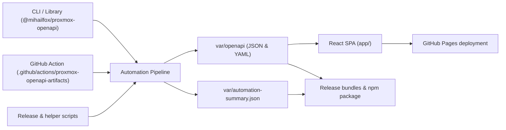
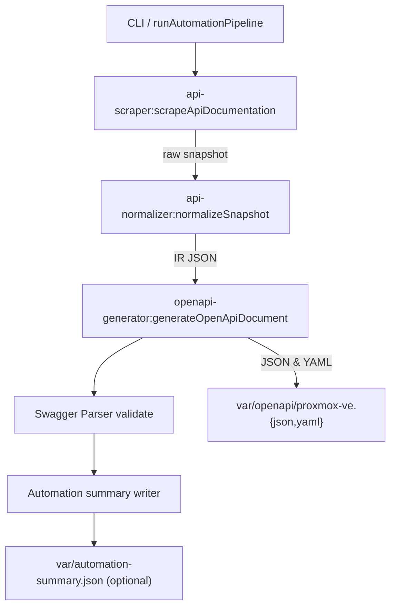

# Architecture Overview

This document explains how the Proxmox OpenAPI toolkit is structured, what each
module is responsible for, and how the components collaborate to generate and
publish Proxmox VE OpenAPI artifacts.

## High-Level Topology

The automation pipeline sits at the center: it ingests data from the Proxmox API
viewer, normalizes the schema, emits OpenAPI bundles, and records run metadata.
The CLI, GitHub Action, and local scripts are convenience layers that invoke the
pipeline. The SPA consumes the generated artifacts to render documentation, while
release tooling packages the outputs for distribution.

## Core Node Package (`packages/proxmox-openapi`)

The workspace package exports both a programmatic API and a CLI. Internally it is
organized into focused modules under `src/internal/`:

- **`api-scraper/`**
  - `scraper.ts` launches Playwright, fetches `apidoc.js`, counts endpoints, and
    persists a timestamped snapshot. It optionally registers a snapshot-aware mock to
    replay cached data during tests (`viewer-mock.ts`).
  - `extractor.ts` and `types.ts` model the viewer payload and provide utilities
    for parsing and sorting the tree.
  - `persistence.ts` writes snapshot files into `var/cache/api-scraper/raw/`.
- **`api-normalizer/`**
  - `normalizer.ts` converts raw snapshots into a stable intermediate
    representation (IR) with consistent slugs, permission metadata, and schema
    constraints, while tracking checksums for provenance.
  - `types.ts` defines the IR schema (`IR_VERSION`, endpoint, security, and schema
    types).
- **`openapi-generator/`**
  - `generator.ts` maps the IR onto an OpenAPI 3.1 document, enriching tag display
    names, grouping segments, attaching security schemes, and embedding
    Proxmox-specific extensions (permissions, optionality, custom metadata).
- **`automation/`**
  - `pipeline.ts` coordinates scrape → normalize → generate → validate, manages
    cache fallback, and writes a run summary (`AutomationPipelineResult`).
  - `cli.ts`/`cli-arg-utils.ts` parse command-line flags for the pipeline entry
    point exposed via `node packages/proxmox-openapi/dist/cli.cjs`.
- **`shared/`**
  - `paths.ts` centralizes path resolution (repo root, `var/` cache, artifact
    locations) so every consumer writes to the same directories.
  - `module-paths.ts` offers import-meta helpers used by mocks and scripts.

The public `index.ts` re-exports these capabilities so external tools can embed
the pipeline or invoke individual stages. The package ships ESM/CJS bundles via
`tsup`, with the CLI registered under the `proxmox-openapi` binary.

### Pipeline Flow (Detailed)

## CLI & Interfaces

- **CLI (`src/run-cli.ts`)** exposes subcommands:
  - `pipeline` executes the full automation run with options for cache reuse,
    offline mode, and report paths.
  - `scrape`, `normalize`, and `generate` mirror individual stages for targeted
    debugging or bespoke workflows.
- **Library API** allows programmatic consumption via `runAutomationPipeline`
  (with injected loggers), `scrapeApiDocumentation`, `normalizeSnapshot`, and
  `generateOpenApiDocument`. Consumers like Terraform provider scaffolding can
  orchestrate custom flows by composing these functions.

## SPA (`app/`)

- Built with Vite and React, the SPA provides marketing pages, documentation
  links, and an API explorer. `App.tsx` wires `react-router` routes into a shared
  layout with dark-mode support.
- `SpecExplorerPage.tsx` dynamically resolves the spec URL (either bundled from
  `var/openapi` or overridden via `VITE_OPENAPI_URL`) and lazily mounts
  `SwaggerViewer.tsx` to keep the initial route fast.
- `SwaggerViewer.tsx` fetches the JSON spec, trims oversized examples, spins up
  Swagger UI, and handles cleanup to avoid leaks. It is deliberately decoupled
  from the pipeline; it only expects the artifacts copied into
  `app/public/openapi/` by `npm run openapi:prepare`.
- `ThemeProvider.tsx` manages light/dark state with localStorage and media query
  fallbacks so the explorer remains accessible.

## Automation & CI

- **GitHub Action** (`.github/actions/proxmox-openapi-artifacts`)
  - `main.mjs` installs dependencies (optionally Playwright browsers), loads the
    published package or falls back to a local build, runs the automation
    pipeline, and surfaces outputs (`from-cache`, paths) to the workflow.
  - `action.yml` wires inputs such as `mode`, cache strategy, and report path.
- **Workflows** (`.github/workflows/`)
  - Pages builds consume the action, run `npm run pages:build`, and deploy the SPA
    with fresh schema bundles.
  - Release workflows re-run automation, package artifacts, publish the npm
    module, and upload GitHub release assets.
- **Scripts** (`scripts/*.mjs`)
  - `openapi-sync.mjs` copies generated artifacts into the SPA assets before dev
    or build steps.
  - `prepare-openapi-release.mjs` assembles release bundles, computes checksums,
    compares against previous tags, and emits markdown notes.
  - `prepare-pages.mjs` stages the SPA build plus OpenAPI bundle in `var/pages/`
    with a `404.html` fallback for GitHub Pages.

## Testing & Quality Gates

- **Unit & Integration Tests**
  - Vitest suites validate normalization, OpenAPI generation, and automation CLI
    parsing.
  - Playwright smoke tests ensure the scraper can load the viewer (with optional
    caching) and that the SPA maintains accessible contrast ratios.
- **Formatting & Hooks**
  - Biome is enforced via git hooks and npm scripts to keep TypeScript/JS sources
    consistent.

## Data & Artifact Lifecycle

1. **Scrape** – Fetch the live viewer or replay cached data to populate
   `var/cache/api-scraper/raw/proxmox-openapi-schema.json`.
2. **Normalize** – Transform the snapshot into
   `var/cache/api-normalizer/ir/proxmox-openapi-ir.json`, preserving metadata and
   checksums.
3. **Generate** – Emit JSON and YAML OpenAPI documents under `var/openapi/` and
   run Swagger Parser validation.
4. **Summarize** – Optionally write `var/automation-summary.json` describing the
   run outcomes for CI, release notes, or documentation.
5. **Consume** –
   - The SPA copies artifacts into `app/public/openapi/` for local dev and into
     `dist/openapi/` for production.
   - Release scripts bundle the artifacts and summary for GitHub Releases and npm
     distribution.

This flow ensures that every consumer—local developers, CI, GitHub Pages, and
downstream automation—draws from the same canonical artifacts.
